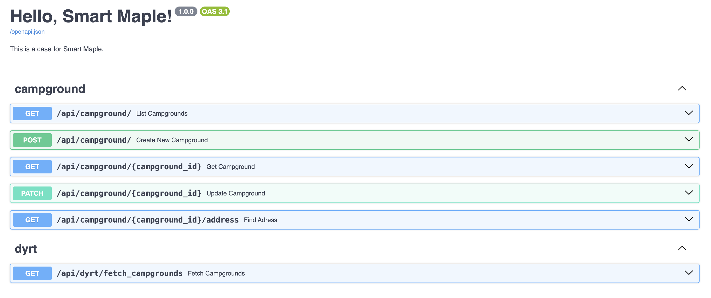

## Overview
This project is a FastAPI-based web application designed to scrape campground data from The Dyrt and store it in a PostgreSQL database. The application includes features such as data validation, scheduling for regular updates, and API endpoints for managing campground data. It is containerized using Docker and uses SQLAlchemy as the ORM for database operations.

---

## Core Features and Solutions

### 1. **Database Connection**
- **Requirement**: Connect to PostgreSQL and create the necessary fields/tables.
- **Solution**:
  - The database connection is handled in [`src/core/db.py`](src/core/db.py). The `DATABASE_URL` is dynamically generated using environment variables defined in the `.env` file.
  - SQLAlchemy is used to define the `DBCampground` model in [`src/models/campground.py`](src/models/campground.py), which maps directly to the `campgrounds` table in the database.
  - The `Base.metadata.create_all(bind=engine)` in [`main.py`](main.py) ensures that the database schema is created automatically.

---

---

### 2. **Scraping Campground Data**
- **Requirement**: Scrape all campground data from The Dyrt's API and store it in the database.
- **Solution**:
  - The scraping logic is implemented in [`src/api/dyrt.py`](src/api/dyrt.py). The `fetch_campgrounds` endpoint fetches data from The Dyrt's API using `httpx`.
  - The request parameters are handled using the `FetchCampgroundsRequest` Pydantic model in [`src/schemas/campground.py`](src/schemas/campground.py). This model ensures that the request is validated and structured properly before being sent to the API.

#### `FetchCampgroundsRequest` Model
The `FetchCampgroundsRequest` model is designed to simplify and validate the request parameters for the `/fetch_campgrounds` endpoint:
- **Fields**:
  - `component`: A `Literal` field that allows only two values: `'US'` or `'TR'`. This ensures that the user selects a valid component without directly providing bounding box (`bbox`) values.
  - `sort`: A `Literal` field that allows only `'Recommended'` or `'Name'`. This avoids passing raw strings and ensures consistency in sorting options.
  - `page_number`: An integer field with validation to ensure the value is between 1 and 5.
  - `page_size`: An integer field with validation to ensure the value is between 1 and 500.
  - `insert_db`: A boolean field that determines whether the fetched data should be inserted into the database.

- **`to_params` Method**:
  - The `to_params` method converts the `FetchCampgroundsRequest` object into a dictionary of parameters suitable for the Dyrt API.
  - The `component` field is used to determine the bounding box (`bbox`) value, which is not directly exposed to the user.
  - The `sort` field is mapped to API-compatible values (`'recommended'` or `'name-raw'`).

#### `/fetch_campgrounds` Endpoint
The `/fetch_campgrounds` endpoint in [`src/api/dyrt.py`](src/api/dyrt.py) uses the `FetchCampgroundsRequest` model to handle incoming requests:
- **Features**:
  - Validates the request parameters using the `FetchCampgroundsRequest` model.
  - Converts the request into API-compatible parameters using the `to_params` method.
  - Implements a retry mechanism with exponential backoff to handle transient errors when fetching data from the Dyrt API.
  - If the `insert_db` field is set to `True`, the response data is parsed and stored in the database using SQLAlchemy models.

- **Why This Design?**:
  - Using `Literal` fields for `component` and `sort` ensures that only valid values are accepted, reducing the risk of invalid requests.
  - The `to_params` method abstracts the complexity of constructing API parameters, making the endpoint easier to use.
  - The `insert_db` field gives users control over whether the fetched data should be stored in the database, providing flexibility in usage.

- **Example Request**:
  ```bash
  GET /api/fetch_campgrounds?component=US&sort=Recommended&page_number=1&page_size=10&insert_db=true

---

### 3. **Data Validation**
- **Requirement**: Validate the data with Pydantic.
- **Solution**:
  - The `Campground` Pydantic model in [`src/models/campground.py`](src/models/campground.py) defines all required fields for validation.
  - The `parse_campgrounds_from_response` function ensures that only valid data is processed and stored in the database.

---

### 4. **Scheduling Regular Updates**
- **Requirement**: Implement cron-like scheduling for regular updates.
- **Solution**:
  - The `APScheduler` library is used in [`src/core/scheduler.py`](src/core/scheduler.py) to schedule the `scheduled_fetch_campgrounds` function.
  - This function fetches campground data from The Dyrt API every hour (as defined in the cron job).

  #### How to Modify the Scheduler
  If you want to test or adjust how the scheduler works, you can modify the parameters (example: second='*/20') of the following line in [`src/core/scheduler.py`](src/core/scheduler.py):

  ```python
  scheduler.add_job(func=scheduled_fetch_campgrounds, trigger='cron', hour='*/1')
---

### 5. **Updating Existing Records**
- **Requirement**: Update existing records if they exist.
- **Solution**:
  - The `PATCH /campground/{campground_id}` endpoint allows partial updates to an existing campground record.
  - The `update_campground` in [`src/api/campground.py`](src/api/campground.py) retrieves the campground by its ID, validates the fields to be updated, and commits the changes to the database.

---

### 6. **Error Handling and Retries**
- **Requirement**: Handle errors in the code, especially HTTP errors, and add retries if necessary.
- **Solution**:
  - Logging is implemented using the `logger` defined in [`src/core/logging.py`](src/core/logging.py). Errors and retries are logged with appropriate severity levels (e.g., `INFO`, `ERROR`).
  - A retry mechanism with exponential backoff is implemented to handle transient errors, ensuring the application remains robust during temporary failures.
---

## Bonus Features

### 1. **Database ORM**
- **Solution**: SQLAlchemy is used as the ORM for all database operations, ensuring clean and efficient interaction with PostgreSQL.

### 2. **Comprehensive Logging**
- **Solution**: Logging is implemented using Python's `logging` module in [`src/core/logging.py`](src/core/logging.py). Logs are generated for key operations, including data fetching, parsing, and database updates.

### 3. **API Endpoints**
- **Solution**: FastAPI endpoints are implemented in [`src/api/campground.py`](src/api/campground.py) and [`src/api/dyrt.py`](src/api/dyrt.py) to manage campground data and trigger the scraper.

### 4. **Performance**
- **Solution**: FastAPI is inherently asynchronous, allowing it to handle multiple requests concurrently without blocking. This makes it well-suited for high-performance applications.
  - The application uses asynchronous programming (`asyncio` and `httpx`) to improve performance during data fetching and processing.
  - The use of `httpx`, an asynchronous HTTP client, ensures that external API calls do not block the event loop, further enhancing the application's responsiveness.

### 5. **Address Lookup**
- **Solution**: The `/campground/{campground_id}/address` endpoint in [`src/api/campground.py`](src/api/campground.py) uses the `geopy` library to find the address of a campground based on its latitude and longitude.

---

## How to Run the Project

### Prerequisites
- Docker and Docker Compose installed on your machine.

### Steps
1. Clone the repository:
   ```bash
   git clone https://github.com/tayfunka/sm_case.git
   cd sm_case

2. Create a .env file in the root directory with the following variables:
   ```env
   POSTGRES_USER=your_postgres_user
   POSTGRES_PASSWORD=your_postgres_password
   POSTGRES_DB=your_postgres_db

3. Build and start the Docker containers:
   ```bash
   docker-compose up --build


### API Documentation

#### How to Access Swagger
Once the application is running, open your browser and navigate to:

- **Swagger UI**: [http://localhost:8000/docs](http://localhost:8000/docs)

#### Features of Swagger UI:
- A list of all available endpoints.
- Detailed information about each endpoint, including request parameters and response formats.
  - Request and response bodies are defined using Pydantic models, such as `FetchCampgroundsRequest` and `FetchCampgroundsResponse` in [`src/schemas/campground.py`](src/schemas/campground.py). These models ensure that the API documentation includes clear and structured data definitions.
  - For example:
    - **Request Body**: The `FetchCampgroundsRequest` model specifies fields like `component`, `sort`, `page_number`, and `page_size`, along with their validation rules.
    - **Response Body**: The `FetchCampgroundsResponse` model defines the structure of the API's response, including `data`, `meta`, and `links`.
  - This approach improves the clarity and usability of the API documentation by providing precise details about the expected input and output for each endpoint.
- The ability to test endpoints directly by sending requests and viewing responses.

